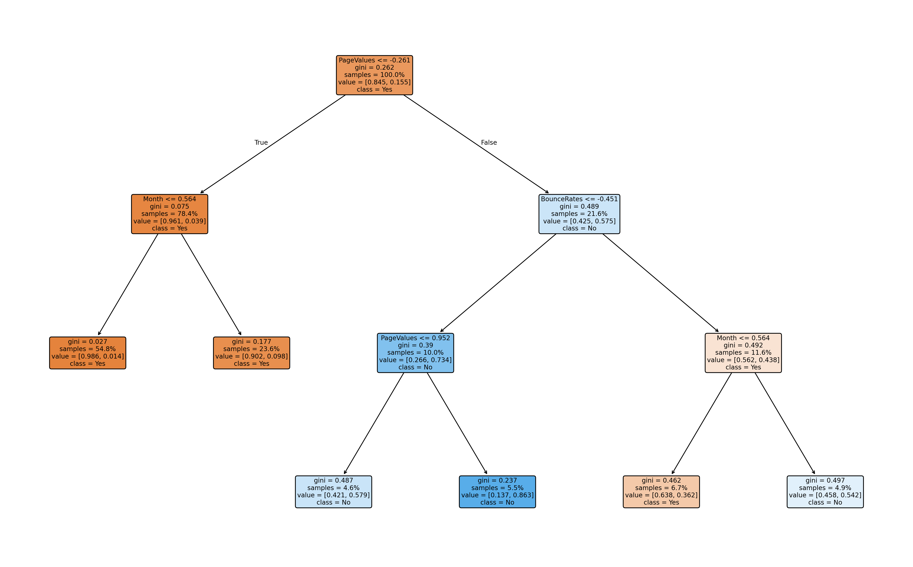
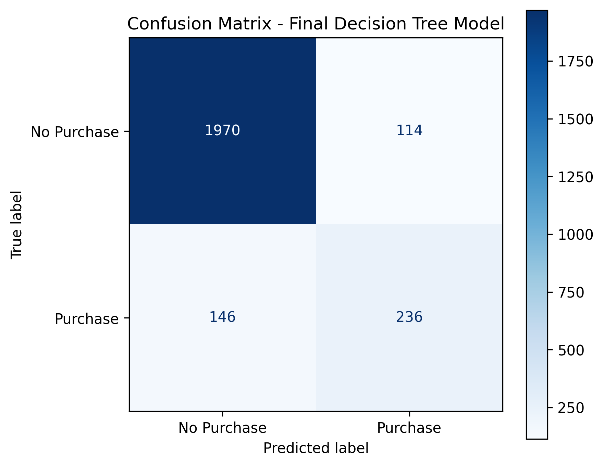

# 🛍️ ShopSmart Purchase Prediction

  <b>Predicting customer purchase intent from online browsing behaviour using Decision Tree Classification.</b>

  
  
  

---

## Overview

Understanding customer purchase intent is a key challenge in e-commerce. While thousands of users browse an online store every day, only a small percentage complete a purchase. Predicting purchase intent enables businesses to improve customer targeting, personalize recommendations, and optimize marketing strategies.

This project develops a Decision Tree-based classification model using the **Online Shoppers Purchasing Intention Dataset**. The workflow includes feature engineering, data preprocessing, model optimization through pruning techniques, and performance evaluation on an imbalanced dataset.

---

## Problem Statement

The dataset contains **12,330 browsing sessions** collected over one year from an online shopping platform. Each session includes behavioural information such as page visits, session duration, bounce rates, visitor type, traffic source, and other customer interaction metrics.

The objective is to predict whether a browsing session will result in a purchase (`Revenue = True`) while improving the model's ability to generalize on unseen data.

---

## Dataset Summary

| Property | Value |
|----------|-------|
| Dataset | Online Shoppers Purchasing Intention |
| Samples | 12,330 |
| Features | 18 |
| Target Variable | Revenue |
| Problem Type | Binary Classification |

---

## Approach

The project follows a structured machine learning pipeline consisting of:

- Data preprocessing
- Behavioural feature engineering
- Label encoding of categorical variables
- Feature scaling using StandardScaler
- Stratified train-test split
- Decision Tree model development
- Model optimization using pre-pruning and post-pruning
- Performance evaluation

---

## Feature Engineering

To better capture customer engagement, two additional behavioural features were created before model training.

### Additional Pages Interaction

A combined engagement metric created using administrative and informational page visits together with the time spent on those pages.

### Time per Product

Average time spent on each product page during a browsing session, providing a better representation of browsing depth than total browsing duration alone.

---

## Model Development

Three Decision Tree models were implemented and compared.

| Model | Description |
|--------|-------------|
| Baseline Decision Tree | Initial benchmark model |
| Pre-Pruned Decision Tree | Reduced overfitting by restricting tree growth |
| Post-Pruned Decision Tree | Optimized using Cost Complexity Pruning (`ccp_alpha`) |

The comparison helps analyze how pruning techniques affect model complexity and predictive performance.

---

## Results

The performance of all three Decision Tree models was compared using training accuracy, testing accuracy, and F1-score.

| Model | Train Accuracy | Test Accuracy | F1-Score | Inference |
|-------|:--------------:|:-------------:|:--------:|-----------|
| Baseline Decision Tree | 99.98% | 85.40% | 0.54 | Overfitting due to unrestricted tree growth. |
| Pre-Pruned Decision Tree | 90.02% | 88.92% | 0.57 | Reduced overfitting with improved generalization. |
| Post-Pruned Decision Tree | 89.62% | **89.45%** | **0.64** | Best overall balance between model complexity and predictive performance. |

---

## Decision Tree Visualization

  

<i>Final post-pruned Decision Tree used for customer purchase prediction.</i>

---

## Confusion Matrix

The confusion matrix summarizes the prediction outcomes of the final Decision Tree model by comparing the actual and predicted class labels.

  

<i>Confusion Matrix of the final post-pruned Decision Tree model.</i>

### Interpretation

- **True Negatives (1970):** Correctly identified sessions where no purchase was made.
- **True Positives (236):** Correctly identified sessions that resulted in a purchase.
- **False Positives (114):** Sessions predicted as purchases that did not result in a purchase.
- **False Negatives (146):** Purchase sessions incorrectly classified as non-purchases.

The model demonstrates strong performance in identifying non-purchasing sessions while maintaining reasonable predictive capability for purchasing sessions despite the class imbalance.

---

## Classification Report

The final model was further evaluated using class-wise precision, recall, and F1-score.

| Class | Precision | Recall | F1-Score | Support |
|------|----------:|-------:|---------:|--------:|
| False | 0.93 | 0.95 | 0.94 | 2084 |
| True | 0.67 | 0.62 | 0.64 | 382 |
| **Accuracy** |  |  | **0.89** | **2466** |
| **Macro Avg** | 0.80 | 0.78 | 0.79 | 2466 |
| **Weighted Avg** | 0.89 | 0.89 | 0.89 | 2466 |

The model performs exceptionally well on the majority class (**No Purchase**) while achieving reasonable performance on the minority class (**Purchase**), which is expected due to the imbalanced nature of the dataset.

---

## Tech Stack

- Python
- Pandas
- NumPy
- Matplotlib
- Scikit-learn
- Jupyter Notebook

---

## Future Improvements

Potential enhancements include:

- Comparing Decision Trees with ensemble methods such as Random Forest and XGBoost
- Hyperparameter tuning using GridSearchCV
- Addressing class imbalance using SMOTE
- Deploying the trained model using Streamlit or Flask
- Improving model interpretability using SHAP

---
